Lorcana Aspire - Filled Template (F# + FsBolero)
===================================================

Note: Documentation has moved to the `docs/` folder. See `docs/README.md` for the full index.

Projects in this solution:
- DeckBuilder.AppHost: Aspire AppHost orchestrating Ollama and Qdrant containers; wires `DeckBuilder.Api`, `DeckBuilder.Ui`, `DeckBuilder.Server`, and `DeckBuilder.Worker`.
- DeckBuilder.Api: F# minimal API for deck building and ingestion; uses embeddings via Ollama and stores vectors in Qdrant.
- DeckBuilder.Server: C# hosting/proxy for the UI/API (reverse proxy/front door).
- DeckBuilder.Ui: FsBolero frontend (F#) that calls `/api/deck` and renders results.
- DeckBuilder.Shared: F# shared models and DTOs used by API and UI.
- DeckBuilder.Worker: Background ingestion worker for initial card/rules population into Qdrant.

## Architecture

```mermaid
graph TD
    %% --- Theme & Global Styles (Blue & Black) ---
    %% Core Nodes (Black body, Blue border, White text)
    classDef core fill:#000,stroke:#00d4ff,stroke-width:2px,color:#fff,font-weight:bold
    
    %% Database Nodes (Black body, Red border)
    classDef db fill:#0d1117,stroke:#ff0055,stroke-width:2px,color:#fff
    
    %% External Nodes (Dashed border)
    classDef ext fill:#0d1117,stroke:#666,stroke-width:2px,stroke-dasharray: 5 5,color:#ccc
    
    %% Subgraph styling (Transparent background, Blue border)
    classDef box fill:none,stroke:#00d4ff,stroke-width:1px,stroke-dasharray: 5 5,color:#00d4ff

    %% --- The Diagram ---
    
    User((👤 User / Browser)):::core
    LorcanaJSON["☁️ LorcanaJSON.org\n(Community Data Source)"]:::ext

    %% Aspire Host Context
    subgraph AspireContext ["🖥️ .NET Aspire Environment"]
        direction TB
        
        %% The actual AppHost Process Node
        Orchestrator["🚀 Aspire AppHost\n(Orchestrator Process)"]:::core
        Dashboard["📊 Dashboard\n(Logs/Metrics)"]:::core
        
        %% Service Containers
        subgraph Services ["🐳 Managed Containers"]
            direction TB
            Backend["⚙️ Backend API (F#)\n(Lorcana.Server)"]:::core
            Client["🌐 WASM Client\n(FsBolero)"]:::core
            Qdrant[("🧠 Qdrant Vector DB")]:::db
        end
    end

    %% --- Connections ---
    
    %% 1. Orchestration Flow (AppHost starts everything)
    Orchestrator -- "Spins Up" --> Backend
    Orchestrator -- "Spins Up" --> Client
    Orchestrator -- "Spins Up" --> Qdrant
    Orchestrator -.->|Telemetry| Dashboard

    %% 2. User Flow
    User -- "1. Loads App" --> Client
    User -- "2. Search Query" --> Client
    Client -- "3. POST /search" --> Backend

    %% 3. Data & RAG Flow
    Backend -- "4. Vector Search" --> Qdrant
    Qdrant -- "5. Results" --> Backend
    Backend -- "Ingest cards.json" --> LorcanaJSON

    %% Link Styling (Blue arrows)
    linkStyle default stroke:#00d4ff,stroke-width:2px,color:#fff
```



## Documentation

- Full docs index: `docs/README.md`
- Key topics: Agentic + RAG, UI/Styling, Operations, Analysis, and Session Summaries.

## Running the Application

```bash
aspire run
```

**That's it!** `aspire run` automatically builds all projects before starting.

## Important Notes

- **Bolero Compatibility**: The UI project targets .NET 8 (Bolero doesn't support .NET 10 yet)
- **Automatic Building**: `aspire run` detects changes and rebuilds automatically
- Replace Data/allCards.json with the full LorcanaJSON dump
- Pull Ollama models locally (GPU-capable) using Ollama CLI:
  - Embedding model: `nomic-embed-text` (768 dims)
  - Generation model: `qwen2.5:14b-instruct`
- The AppHost will automatically start Ollama and Qdrant containers
- Adjust model names in code if you use different model tags

## Troubleshooting

If you encounter console errors, see [docs/BOLERO_FIX.md](docs/BOLERO_FIX.md) for detailed troubleshooting.

### Manual Build (if needed)
```bash
dotnet build
aspire run
```
